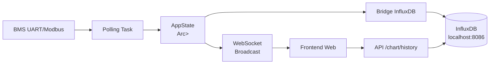
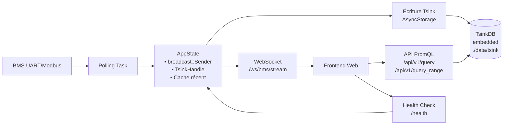

# 📋 Plan de Migration : InfluxDB → TsinkDB + PromQL  
## Projet : Daly-BMS-Rust  
*Document technique pour migration vers une architecture temps réel embarquée*

---

## 🎯 Objectifs

| Objectif | Description |
|----------|-------------|
| **Supprimer InfluxDB** | Éliminer la dépendance externe et simplifier le déploiement |
| **Embarquer Tsink** | Utiliser Tsink en mode `AsyncStorage` pour le stockage historique |
| **Temps réel robuste** | WebSocket + `broadcast::channel` pour des mises à jour <100ms |
| **Requêtes avancées** | Exposer une API PromQL-compatible pour l'historique et l'analytique |
| **Migration douce** | Dual-write temporaire pour valider Tsink avant cut-over |

---

## 🏗️ Architecture : Avant / Après

### 🔹 Architecture actuelle (avec InfluxDB)



### 🔹 Architecture cible (Tsink embarqué + PromQL)



---

## 📦 Phase 0 : Préparation du Workspace

### 1. Mettre à jour les dépendances

**Fichier : `Cargo.toml` (racine du workspace)**

```toml
[workspace.dependencies]
# ... dépendances existantes ...

# ➕ Ajout de Tsink
tsink = { version = "0.10", features = ["async-storage", "promql"] }

# ➕ Utilitaires pour le temps réel
tokio = { version = "1", features = ["sync", "time", "macros"] }
serde = { version = "1", features = ["derive"] }
serde_json = "1"
tracing = "0.1"
```

**Fichier : `crates/daly-bms-server/Cargo.toml`**

```toml
[dependencies]
# ... dépendances existantes ...

tsink = { workspace = true }

# ➕ Nettoyage : retirer les dépendances InfluxDB
# influxdb2 = { workspace = true }          # ← À COMMENTER/SUPPRIMER
# influxdb2-structmap = { workspace = true } # ← À COMMENTER/SUPPRIMER
```

### 2. Créer la structure de modules

```bash
crates/daly-bms-server/src/
├── main.rs
├── state.rs              # ← À modifier : AppState + broadcast
├── tsink_db.rs           # ← NOUVEAU : Wrapper Tsink + PromQL
├── api/
│   ├── mod.rs            # ← À modifier : routes WebSocket + PromQL
│   ├── ws.rs             # ← NOUVEAU (optionnel) : handlers WebSocket
│   └── promql.rs         # ← NOUVEAU (optionnel) : handlers PromQL
├── bridges/
│   ├── mod.rs
│   └── influx.rs         # ← À migrer vers tsink_writer.rs
└── config.rs             # ← À mettre à jour : retirer config InfluxDB
```

---

## 🗄️ Phase 1 : Implémentation de `TsinkHandle`

**Fichier : `crates/daly-bms-server/src/tsink_db.rs`**

```rust
//! Wrapper asynchrone pour TsinkDB avec support PromQL

use std::sync::Arc;
use std::time::Duration;
use tsink::{AsyncStorage, AsyncStorageBuilder, DataPoint, Label, Row, Value};
use tracing::{info, warn};

pub type Result<T> = std::result::Result<T, TsinkError>;

#[derive(Debug, thiserror::Error)]
pub enum TsinkError {
    #[error("Tsink storage error: {0}")]
    Storage(#[from] tsink::Error),
    #[error("IO error: {0}")]
    Io(#[from] std::io::Error),
    #[error("Serialization error: {0}")]
    Serialization(#[from] serde_json::Error),
    #[error("Query error: {0}")]
    Query(String),
}

#[derive(Clone)]
pub struct TsinkHandle {
    storage: Arc<AsyncStorage>,
    retention: Duration,
}

impl TsinkHandle {
    /// Initialise Tsink en mode embarqué
    pub async fn new(data_path: &str, retention_days: u64) -> Result<Self> {
        let retention = Duration::from_secs(retention_days * 24 * 3600);
        
        let storage = AsyncStorageBuilder::new()
            .with_data_path(data_path)
            .with_timestamp_precision(tsink::TimestampPrecision::Milliseconds)
            .with_retention(retention)
            .with_memory_limit(512 * 1024 * 1024) // 512 MB
            .with_cardinality_limit(100_000)
            .build()
            .map_err(TsinkError::Storage)?;

        info!("Tsink initialized at '{}' with {} days retention", 
              data_path, retention_days);
        
        Ok(Self { 
            storage: Arc::new(storage), 
            retention 
        })
    }

    /// Écriture d'un point de métrique avec tags
    pub async fn write(
        &self,
        measurement: &str,
        tags: Vec<(&str, String)>,
        value: f64,
        timestamp: Option<i64>,
    ) -> Result<()> {
        let ts = timestamp.unwrap_or_else(|| chrono::Utc::now().timestamp_millis());
        
        let row = Row::with_labels(
            measurement,
            tags.into_iter().map(|(k, v)| Label::new(k, v)).collect(),
            DataPoint::new(ts, Value::Float(value)),
        );
        
        self.storage.insert_row(row).await.map_err(TsinkError::Storage)?;
        Ok(())
    }

    /// Écriture batch de plusieurs points (optimisé)
    pub async fn write_batch(&self, rows: Vec<Row>) -> Result<()> {
        if rows.is_empty() { return Ok(()); }
        self.storage.insert_rows(rows).await.map_err(TsinkError::Storage)?;
        Ok(())
    }

    /// Requête PromQL instantanée : /api/v1/query
    pub async fn query_instant(
        &self,
        query: &str,
        eval_time: Option<i64>,
    ) -> Result<serde_json::Value> {
        let eval_ts = eval_time.unwrap_or_else(|| chrono::Utc::now().timestamp_millis());
        
        // Tsink expose une API PromQL interne
        let result = self.storage.promql_query(query, eval_ts)
            .await
            .map_err(|e| TsinkError::Query(e.to_string()))?;
        
        // Formatage réponse compatible Prometheus HTTP API
        Ok(serde_json::json!({
            "status": "success",
            "data": {
                "resultType": "vector",
                "result": result
            }
        }))
    }

    /// Requête PromQL avec range : /api/v1/query_range
    pub async fn query_range(
        &self,
        query: &str,
        start: i64,
        end: i64,
        step: i64,
    ) -> Result<serde_json::Value> {
        let result = self.storage.promql_range_query(query, start, end, step)
            .await
            .map_err(|e| TsinkError::Query(e.to_string()))?;
        
        Ok(serde_json::json!({
            "status": "success",
            "data": {
                "resultType": "matrix",
                "result": result
            }
        }))
    }

    /// Requête bas niveau par metric + tags (fallback simple)
    pub async fn query_by_metric(
        &self,
        metric: &str,
        tags: &[(&str, &str)],
        start: i64,
        end: i64,
    ) -> Result<Vec<DataPoint>> {
        let labels: Vec<Label> = tags.iter()
            .map(|(k, v)| Label::new(k, *v))
            .collect();
        
        self.storage.select(metric, &labels, start, end)
            .await
            .map_err(TsinkError::Storage)
    }

    /// Stats pour health check
    pub fn stats(&self) -> tsink::StorageStats {
        self.storage.stats()
    }

    /// Force une compaction (utile pour tests ou maintenance)
    pub async fn compact(&self) -> Result<()> {
        self.storage.compact().await.map_err(TsinkError::Storage)?;
        Ok(())
    }
}
```

---

## 🔄 Phase 2 : Mise à jour de `AppState`

**Fichier : `crates/daly-bms-server/src/state.rs`**

```rust
use std::sync::Arc;
use tokio::sync::{broadcast, RwLock};
use crate::{config::Config, models::BmsSnapshot, tsink_db::TsinkHandle};

// ➕ Nouveau type pour le cache récent (optionnel mais recommandé)
use dashmap::DashMap;

pub struct AppState {
    // Configuration
    pub config: Arc<Config>,
    
    // Buffer circulaire pour les snapshots récents (fallback si Tsink indisponible)
    pub snapshot_buffer: Arc<RwLock<Vec<BmsSnapshot>>>,
    
    // ➕ Handle Tsink pour écriture/lecture historique
    pub tsink_handle: Arc<TsinkHandle>,
    
    // ➕ Broadcast channel pour WebSocket temps réel
    pub ws_broadcast_sender: broadcast::Sender<Arc<BmsSnapshot>>,
    
    // ➕ Cache mémoire pour requêtes fréquentes (< 5 min)
    pub recent_cache: Arc<DashMap<String, Vec<tsink::DataPoint>>>,
    
    // Compteurs de santé
    pub bms_count: Arc<std::sync::atomic::AtomicUsize>,
    pub last_poll_time: Arc<RwLock<i64>>,
}

impl AppState {
    pub async fn new(config: Config, tsink_handle: TsinkHandle) -> Self {
        // Channel broadcast : 100 messages en buffer, chaque snapshot est Arc pour clone léger
        let (ws_tx, _) = broadcast::channel(100);
        
        Self {
            config: Arc::new(config),
            snapshot_buffer: Arc::new(RwLock::new(Vec::with_capacity(100))),
            tsink_handle: Arc::new(tsink_handle),
            ws_broadcast_sender: ws_tx,
            recent_cache: Arc::new(DashMap::new()),
            bms_count: Arc::new(std::sync::atomic::AtomicUsize::new(0)),
            last_poll_time: Arc::new(RwLock::new(0)),
        }
    }

    /// Appelée à chaque nouveau snapshot BMS
    pub async fn on_snapshot(&self, mut snap: BmsSnapshot) {
        let now = chrono::Utc::now().timestamp_millis();
        snap.timestamp = now;
        
        let snap_arc = Arc::new(snap);
        
        // 1️⃣ Mise à jour du buffer circulaire (fallback)
        {
            let mut buffer = self.snapshot_buffer.write().await;
            buffer.push((*snap_arc).clone());
            if buffer.len() > 100 {
                buffer.remove(0);
            }
        }
        
        // 2️⃣ Broadcast WebSocket (temps réel)
        let _ = self.ws_broadcast_sender.send(Arc::clone(&snap_arc));
        
        // 3️⃣ Écriture dans Tsink (background, non-bloquant)
        let tsink = Arc::clone(&self.tsink_handle);
        let snap_clone = Arc::clone(&snap_arc);
        tokio::spawn(async move {
            if let Err(e) = Self::write_snapshot_to_tsink(&tsink, &snap_clone).await {
                warn!("Failed to write snapshot to Tsink: {}", e);
            }
        });
        
        // 4️⃣ Mise à jour du cache récent (optionnel)
        self.update_recent_cache(&snap_arc).await;
    }

    /// Convertit un BmsSnapshot en lignes Tsink
    async fn write_snapshot_to_tsink(
        tsink: &TsinkHandle,
        snap: &BmsSnapshot,
    ) -> crate::tsink_db::Result<()> {
        let bms_tag = ("bms_id", snap.address.to_string());
        let ts = snap.timestamp;
        
        // Regrouper les écritures en batch pour performance
        let mut rows = Vec::with_capacity(10);
        
        // Métriques DC
        rows.push(tsink::Row::with_labels(
            "bms_voltage",
            vec![tsink::Label::new(bms_tag.0, &bms_tag.1)],
            tsink::DataPoint::new(ts, tsink::Value::Float(snap.dc.voltage)),
        ));
        rows.push(tsink::Row::with_labels(
            "bms_current",
            vec![tsink::Label::new(bms_tag.0, &bms_tag.1)],
            tsink::DataPoint::new(ts, tsink::Value::Float(snap.dc.current)),
        ));
        rows.push(tsink::Row::with_labels(
            "bms_power",
            vec![tsink::Label::new(bms_tag.0, &bms_tag.1)],
            tsink::DataPoint::new(ts, tsink::Value::Float(snap.dc.power)),
        ));
        
        // SOC / SOH
        rows.push(tsink::Row::with_labels(
            "bms_soc",
            vec![tsink::Label::new(bms_tag.0, &bms_tag.1)],
            tsink::DataPoint::new(ts, tsink::Value::Float(snap.soc as f64)),
        ));
        rows.push(tsink::Row::with_labels(
            "bms_soh",
            vec![tsink::Label::new(bms_tag.0, &bms_tag.1)],
            tsink::DataPoint::new(ts, tsink::Value::Float(snap.soh.unwrap_or(100.0))),
        ));
        
        // Températures (si disponibles)
        if let Some(temps) = &snap.temperatures {
            for (i, t) in temps.iter().enumerate() {
                rows.push(tsink::Row::with_labels(
                    "bms_temperature",
                    vec![
                        tsink::Label::new(bms_tag.0, &bms_tag.1),
                        tsink::Label::new("sensor_idx", &i.to_string()),
                    ],
                    tsink::DataPoint::new(ts, tsink::Value::Float(*t as f64)),
                ));
            }
        }
        
        // Cell voltages (optionnel : peut générer beaucoup de séries)
        if let Some(cells) = &snap.cell_voltages {
            for (i, v) in cells.iter().enumerate() {
                rows.push(tsink::Row::with_labels(
                    "bms_cell_voltage",
                    vec![
                        tsink::Label::new(bms_tag.0, &bms_tag.1),
                        tsink::Label::new("cell_idx", &i.to_string()),
                    ],
                    tsink::DataPoint::new(ts, tsink::Value::Float(*v)),
                ));
            }
        }
        
        tsink.write_batch(rows).await?;
        Ok(())
    }

    /// Met à jour le cache récent pour les requêtes fréquentes
    async fn update_recent_cache(&self, snap: &Arc<BmsSnapshot>) {
        // Exemple : cache pour "voltage" du BMS principal
        let key = format!("voltage:bms_{}", snap.address);
        let point = tsink::DataPoint::new(
            snap.timestamp,
            tsink::Value::Float(snap.dc.voltage),
        );
        
        let mut cache_entry = self.recent_cache.entry(key).or_insert_with(Vec::new);
        cache_entry.push(point);
        
        // Garder seulement les 5 dernières minutes (300 secondes)
        let cutoff = snap.timestamp - 300_000;
        cache_entry.retain(|p| p.timestamp() >= cutoff);
    }
}
```

---

## 📡 Phase 3 : WebSocket Temps Réel

**Fichier : `crates/daly-bms-server/src/api/ws.rs`**

```rust
//! Handlers WebSocket pour le flux temps réel BMS

use axum::{
    extract::{ws::{Message, WebSocket, WebSocketUpgrade}, State},
    response::IntoResponse,
};
use futures_util::{SinkExt, StreamExt};
use serde_json::json;
use tracing::{debug, info, warn};

use crate::state::AppState;

/// Endpoint principal : GET /ws/bms/stream
pub async fn ws_bms_stream(
    ws: WebSocketUpgrade,
    State(state): State<AppState>,
) -> impl IntoResponse {
    ws.on_upgrade(|socket| handle_websocket(socket, state))
}

/// Gestionnaire de connexion WebSocket
async fn handle_websocket(mut socket: WebSocket, state: AppState) {
    info!("WebSocket client connected");
    
    // Message de bienvenue
    if socket.send(Message::Text(
        json!({"type": "connected", "ts": chrono::Utc::now().timestamp_millis()}).to_string()
    )).await.is_err() {
        return;
    }
    
    // Souscription au broadcast channel
    let mut rx = state.ws_broadcast_sender.subscribe();
    
    loop {
        tokio::select! {
            // 📥 Réception d'un nouveau snapshot BMS
            Ok(snap) = rx.recv() => {
                match serde_json::to_string(&*snap) {
                    Ok(json_str) => {
                        if socket.send(Message::Text(json_str)).await.is_err() {
                            debug!("Client disconnected during send");
                            break;
                        }
                    }
                    Err(e) => warn!("Failed to serialize snapshot: {}", e),
                }
            }
            
            // 📤 Gestion des messages entrants du client
            Some(msg_result) = socket.recv() => {
                match msg_result {
                    Ok(Message::Text(txt)) => {
                        // Support commande "ping" / "unsubscribe"
                        match txt.as_str() {
                            "ping" => {
                                let _ = socket.send(Message::Text(
                                    json!({"type": "pong", "ts": chrono::Utc::now().timestamp_millis()}).to_string()
                                )).await;
                            }
                            "unsubscribe" => {
                                info!("Client requested unsubscribe");
                                break;
                            }
                            _ => debug!("Unknown client message: {}", txt),
                        }
                    }
                    Ok(Message::Close(_)) | Err(_) => {
                        debug!("WebSocket connection closed");
                        break;
                    }
                    _ => {} // Ignorer binary, ping/pong framework
                }
            }
        }
    }
    
    info!("WebSocket client disconnected");
}
```

**Mise à jour de `crates/daly-bms-server/src/api/mod.rs`**

```rust
pub mod ws;      // ← Nouveau module
pub mod promql;  // ← Nouveau module (voir Phase 4)
pub mod health;  // ← Optionnel : health check

use axum::Router;
use crate::state::AppState;

pub fn build_router() -> Router<AppState> {
    Router::new()
        // Routes existantes...
        
        // ➕ WebSocket temps réel
        .route("/ws/bms/stream", axum::routing::get(ws::ws_bms_stream))
        
        // ➕ API PromQL (Phase 4)
        .route("/api/v1/query", axum::routing::get(promql::query_instant))
        .route("/api/v1/query_range", axum::routing::get(promql::query_range))
        
        // ➕ Health check
        .route("/health", axum::routing::get(health::health_check))
}
```

---

## 🔍 Phase 4 : API PromQL pour l'Historique

**Fichier : `crates/daly-bms-server/src/api/promql.rs`**

```rust
//! API compatible Prometheus HTTP API pour requêtes PromQL sur Tsink

use axum::{
    extract::{Query, State},
    http::StatusCode,
    response::{IntoResponse, Response},
    Json,
};
use serde::Deserialize;
use tracing::warn;

use crate::{state::AppState, tsink_db::TsinkError};

// ➕ Paramètres pour /api/v1/query (instant query)
#[derive(Deserialize)]
pub struct InstantQueryParams {
    pub query: String,
    pub time: Option<i64>,           // timestamp en ms, défaut: now
    pub timeout: Option<String>,     // ignoré pour l'instant
}

// ➕ Paramètres pour /api/v1/query_range
#[derive(Deserialize)]
pub struct RangeQueryParams {
    pub query: String,
    pub start: i64,                  // timestamp début en ms
    pub end: i64,                    // timestamp fin en ms
    pub step: i64,                   // pas en ms
    pub timeout: Option<String>,
}

// ➕ Réponse d'erreur standardisée
#[derive(serde::Serialize)]
struct ApiError {
    status: String,
    error: String,
    #[serde(skip_serializing_if = "Option::is_none")]
    error_type: Option<String>,
}

impl IntoResponse for ApiError {
    fn into_response(self) -> Response {
        (StatusCode::BAD_REQUEST, Json(self)).into_response()
    }
}

/// GET /api/v1/query - Requête PromQL instantanée
/// Exemple : /api/v1/query?query=bms_voltage{bms_id="1"}
pub async fn query_instant(
    State(state): State<AppState>,
    Query(params): Query<InstantQueryParams>,
) -> Result<Json<serde_json::Value>, ApiError> {
    
    match state.tsink_handle.query_instant(&params.query, params.time).await {
        Ok(response) => Ok(Json(response)),
        Err(TsinkError::Query(e)) => {
            warn!("PromQL query error: {}", e);
            Err(ApiError {
                status: "error".into(),
                error: e,
                error_type: Some("bad_data".into()),
            })
        }
        Err(e) => {
            warn!("Internal Tsink error: {}", e);
            Err(ApiError {
                status: "error".into(),
                error: "internal_error".into(),
                error_type: Some("internal".into()),
            })
        }
    }
}

/// GET /api/v1/query_range - Requête PromQL avec range temporelle
/// Exemple : /api/v1/query_range?query=bms_soc{bms_id="1"}&start=1700000000000&end=1700086400000&step=60000
pub async fn query_range(
    State(state): State<AppState>,
    Query(params): Query<RangeQueryParams>,
) -> Result<Json<serde_json::Value>, ApiError> {
    
    // Validation basique des paramètres
    if params.start > params.end {
        return Err(ApiError {
            status: "error".into(),
            error: "start timestamp must be before end".into(),
            error_type: Some("bad_data".into()),
        });
    }
    if params.step <= 0 {
        return Err(ApiError {
            status: "error".into(),
            error: "step must be positive".into(),
            error_type: Some("bad_data".into()),
        });
    }
    
    match state.tsink_handle.query_range(&params.query, params.start, params.end, params.step).await {
        Ok(response) => Ok(Json(response)),
        Err(TsinkError::Query(e)) => {
            warn!("PromQL range query error: {}", e);
            Err(ApiError {
                status: "error".into(),
                error: e,
                error_type: Some("bad_data".into()),
            })
        }
        Err(e) => {
            warn!("Internal Tsink error: {}", e);
            Err(ApiError {
                status: "error".into(),
                error: "internal_error".into(),
                error_type: Some("internal".into()),
            })
        }
    }
}

/// GET /api/v1/labels - Liste des labels disponibles (optionnel, pour autocomplete frontend)
pub async fn list_labels(
    State(state): State<AppState>,
    Query(params): Query<serde_json::Value>, // start/end optionnels
) -> Json<serde_json::Value> {
    
    // Tsink peut exposer les labels via son API interne
    // Pour l'instant, on retourne les labels connus de l'application
    Json(json!({
        "status": "success",
        "data": [
            "bms_id",
            "sensor_idx", 
            "cell_idx",
            "alert_type"
        ]
    }))
}

/// GET /api/v1/label/<label_name>/values - Valeurs d'un label (optionnel)
pub async fn label_values(
    State(state): State<AppState>,
    axum::extract::Path(label_name): axum::extract::Path<String>,
) -> Json<serde_json::Value> {
    
    // Exemple pour bms_id : retourner les BMS connus
    if label_name == "bms_id" {
        // Ici, on pourrait interroger Tsink pour les valeurs distinctes
        // Pour l'instant, fallback sur un cache ou liste statique
        Json(json!({
            "status": "success",
            "data": ["1", "2", "3"] // À dynamiser
        }))
    } else {
        Json(json!({
            "status": "success",
            "data": []
        }))
    }
}
```

**Exemples de requêtes PromQL utilisables côté frontend**

```promql
# Voltage actuel du BMS #1
bms_voltage{bms_id="1"}

# SOC moyen sur les 5 dernières minutes (step 30s)
avg_over_time(bms_soc{bms_id="1"}[5m])

# Température max parmi tous les capteurs du BMS #1
max(bms_temperature{bms_id="1"})

# Détection de surchauffe : température > 45°C
bms_temperature{bms_id="1"} > 45

# Puissance moyenne par heure sur les dernières 24h
avg_over_time(bms_power{bms_id="1"}[1h])

# Comparaison voltage cellule 1 vs cellule 2
bms_cell_voltage{bms_id="1", cell_idx="0"} - bms_cell_voltage{bms_id="1", cell_idx="1"}
```

---

## 🩺 Phase 5 : Health Check & Monitoring

**Fichier : `crates/daly-bms-server/src/api/health.rs`**

```rust
//! Endpoint de santé pour supervision

use axum::{extract::State, Json};
use serde_json::json;
use crate::state::AppState;

#[derive(serde::Serialize)]
pub struct HealthResponse {
    pub status: String,
    pub services: ServiceStatus,
    pub metrics: Option<MetricsSummary>,
}

#[derive(serde::Serialize)]
pub struct ServiceStatus {
    pub tsink: String,      // "ok", "degraded", "error"
    pub websocket: String,  // nombre de clients connectés
    pub bms_polling: String,// "active", "inactive"
}

#[derive(serde::Serialize)]
pub struct MetricsSummary {
    pub ws_clients: usize,
    pub bms_count: usize,
    pub last_poll_ms: i64,
    pub tsink_series_count: Option<u64>,
}

/// GET /health - Endpoint de santé complet
pub async fn health_check(State(state): State<AppState>) -> Json<HealthResponse> {
    let now = chrono::Utc::now().timestamp_millis();
    
    // Statut Tsink
    let tsink_status = match state.tsink_handle.stats() {
        stats => {
            // Vérification basique : si on peut lire les stats, c'est ok
            "ok"
        }
    };
    
    // Nombre de clients WebSocket connectés
    let ws_clients = state.ws_broadcast_sender.receiver_count();
    
    // Dernière activité de polling BMS
    let last_poll = *state.last_poll_time.read().await;
    let polling_status = if now - last_poll < 30_000 { "active" } else { "inactive" };
    
    Json(HealthResponse {
        status: if tsink_status == "ok" && polling_status == "active" { 
            "healthy" 
        } else { 
            "degraded" 
        }.into(),
        services: ServiceStatus {
            tsink: tsink_status.into(),
            websocket: format!("{} clients", ws_clients),
            bms_polling: polling_status.into(),
        },
        metrics: Some(MetricsSummary {
            ws_clients,
            bms_count: state.bms_count.load(std::sync::atomic::Ordering::Relaxed),
            last_poll_ms: last_poll,
            tsink_series_count: None, // Optionnel : appeler une API Tsink pour compter les séries
        }),
    })
}

/// GET /metrics - Endpoint compatible Prometheus (optionnel)
pub async fn prometheus_metrics(State(state): State<AppState>) -> String {
    let mut output = String::new();
    
    // Métriques custom au format Prometheus exposition
    output.push_str(&format!(
        "# HELP daly_bms_ws_clients Nombre de clients WebSocket connectés\n\
         # TYPE daly_bms_ws_clients gauge\n\
         daly_bms_ws_clients {}\n",
        state.ws_broadcast_sender.receiver_count()
    ));
    
    output.push_str(&format!(
        "# HELP daly_bms_polling_last_timestamp_ms Timestamp du dernier polling BMS\n\
         # TYPE daly_bms_polling_last_timestamp_ms gauge\n\
         daly_bms_polling_last_timestamp_ms {}\n",
        *state.last_poll_time.read().await
    ));
    
    // Stats Tsink (si disponibles)
    let stats = state.tsink_handle.stats();
    output.push_str(&format!(
        "# HELP daly_bms_tsink_series_count Nombre de séries temporelles dans Tsink\n\
         # TYPE daly_bms_tsink_series_count gauge\n\
         daly_bms_tsink_series_count {}\n",
        stats.series_count.unwrap_or(0)
    ));
    
    output
}
```

---

## 🔄 Phase 6 : Migration Progressive (Dual-Write)

### Stratégie de transition sans downtime

```rust
// Dans crates/daly-bms-server/src/main.rs

#[tokio::main]
async fn main() -> anyhow::Result<()> {
    // ... initialisation config, tracing, etc.
    
    // ➕ Initialisation Tsink (toujours)
    let tsink = TsinkHandle::new(&config.tsink.data_path, config.tsink.retention_days)
        .await
        .context("Failed to initialize Tsink")?;
    
    // ➕ AppState avec Tsink
    let state = AppState::new(config.clone(), tsink).await;
    
    // ➕ Optionnel : client InfluxDB pour dual-write temporaire
    #[cfg(feature = "influx-migration")]
    let influx_client = if config.influxdb.enabled {
        Some(InfluxClient::new(&config.influxdb).await?)
    } else {
        None
    };
    
    // Spawn des tâches background
    tokio::spawn(polling_task(state.clone()));
    
    #[cfg(feature = "influx-migration")]
    if let Some(client) = influx_client.clone() {
        // Dual-write : écrire dans InfluxDB ET Tsink pendant la transition
        tokio::spawn(migration_bridge(state.clone(), client));
    }
    
    // ... démarrage serveur Axum
}
```

### Feature flag pour migration contrôlée

**Dans `crates/daly-bms-server/Cargo.toml`**

```toml
[features]
default = []
influx-migration = ["influxdb2", "influxdb2-structmap"]  # Feature optionnelle
```

**Dans le code** :

```rust
#[cfg(feature = "influx-migration")]
use influxdb2::{Client as InfluxClient, structs::WritePrecision};

#[cfg(feature = "influx-migration")]
async fn migration_bridge(state: AppState, influx: InfluxClient) {
    let mut rx = state.ws_broadcast_sender.subscribe();
    
    while let Ok(snap) = rx.recv().await {
        // Écrire dans InfluxDB en parallèle de Tsink
        let _ = influx.write(
            &config.influxdb.bucket,
            Some(&config.influxdb.org),
            vec![snap_to_influx_point(&snap)],
            None,
            Some(WritePrecision::Ms),
        ).await;
    }
}
```

✅ **Avantage** : Vous pouvez activer/désactiver le dual-write via `--features influx-migration` sans modifier le code.

---

## 🧪 Phase 7 : Tests & Validation

### Checklist de validation

```markdown
## ✅ Tests unitaires
- [ ] `TsinkHandle::write()` écrit correctement dans un répertoire temporaire
- [ ] `TsinkHandle::query_instant()` retourne un format JSON valide
- [ ] `on_snapshot()` publie bien dans le broadcast channel
- [ ] WebSocket handler gère déconnexion proprement

## ✅ Tests d'intégration
- [ ] Lancement serveur : dossier `./data/tsink` créé automatiquement
- [ ] Connexion WebSocket : réception de snapshots en <100ms
- [ ] Requête PromQL : `bms_voltage{bms_id="1"}` retourne des données
- [ ] Redémarrage serveur : les données Tsink sont persistées et lisibles

## ✅ Tests de charge (optionnel mais recommandé)
- [ ] 10 snapshots/seconde pendant 10 minutes → CPU <80%, RAM stable
- [ ] 20 clients WebSocket simultanés → pas de fuite mémoire
- [ ] Requête PromQL complexe sur 24h de données → réponse <2s

## ✅ Tests de résilience
- [ ] Coupure disque simulée → Tsink gère l'erreur proprement
- [ ] Redémarrage brutal (`kill -9`) → WAL replay fonctionne au restart
- [ ] Corruption de fichier Tsink → mode salvage ou erreur claire
```

### Script de test rapide (bash)

```bash
#!/bin/bash
# test_tsink_migration.sh

set -e

echo "🚀 Démarrage du serveur en mode test..."
cargo run --bin daly-bms-server -- --config test-config.toml &
SERVER_PID=$!
sleep 3

echo "🔌 Test WebSocket..."
# Utiliser websocat ou un script Python pour tester
echo '{"test":"ping"}' | websocat -n1 -E ws://localhost:3000/ws/bms/stream

echo "📊 Test API PromQL..."
curl -s "http://localhost:3000/api/v1/query?query=bms_voltage" | jq .

echo "🩺 Test health check..."
curl -s "http://localhost:3000/health" | jq .

echo "🛑 Arrêt du serveur..."
kill $SERVER_PID
wait $SERVER_PID 2>/dev/null || true

echo "✅ Tests terminés"
```

---

## 🗂️ Configuration Exemple

**Fichier : `config.toml`**

```toml
[server]
host = "0.0.0.0"
port = 3000

[tsink]
data_path = "./data/tsink"
retention_days = 30
memory_limit_mb = 512
cardinality_limit = 100000

# Optionnel : paramètres avancés Tsink
[tsink.advanced]
compression = "gorilla"      # Déjà par défaut
wal_flush_interval_ms = 1000
max_segment_size_mb = 256

# ➕ Ancienne section InfluxDB (à garder pendant dual-write)
[influxdb]
enabled = false              # ← Basculer à false après validation
url = "http://localhost:8086"
bucket = "daly-bms"
org = "myorg"
token = "your-token-here"

[bms]
port = "/dev/ttyUSB0"
baud_rate = 9600
poll_interval_ms = 1000

[logging]
level = "info"
file = "./logs/daly-bms.log"
```

---

## 🛠️ Dépannage & FAQ

### ❓ Tsink ne crée pas le dossier `data_path`

```rust
// Solution : créer le dossier avant d'initialiser Tsink
std::fs::create_dir_all(&config.tsink.data_path)
    .context("Failed to create Tsink data directory")?;
```

### ❓ Erreur "cardinality limit exceeded"

Tsink limite le nombre de séries uniques (metric + combinaison de tags).

```toml
# Solution 1 : augmenter la limite (consomme plus de RAM)
[tsink]
cardinality_limit = 500000

# Solution 2 : réduire la granularité des tags
# ❌ Éviter : cell_voltage{cell_idx="0", timestamp_unique="..."}
# ✅ Préférer : cell_voltage{cell_idx="0"} + timestamp dans le point
```

### ❓ Requête PromQL lente sur grand historique

```promql
# Optimisations :
# 1. Filtrer par tags le plus tôt possible
bms_voltage{bms_id="1"}  # ✅
bms_voltage              # ❌ (scanne toutes les séries)

# 2. Utiliser des fonctions d'agrégation pour réduire les points
avg_over_time(bms_voltage[5m])  # ✅ au lieu de raw data

# 3. Ajuster le paramètre `step` dans query_range
#    step=60000 (1 min) au lieu de step=1000 (1 sec) pour les graphiques
```

### ❓ WebSocket se déconnecte aléatoirement

```rust
// Ajouter un heartbeat côté serveur
async fn handle_websocket(mut socket: WebSocket, state: AppState) {
    let mut heartbeat = tokio::time::interval(Duration::from_secs(30));
    
    loop {
        tokio::select! {
            _ = heartbeat.tick() => {
                // Envoyer un ping framework WebSocket
                if socket.send(Message::Ping(vec![])).await.is_err() {
                    break;
                }
            }
            // ... reste du code existant ...
        }
    }
}
```

### ❓ Migration des données historiques depuis InfluxDB

```python
# migrate_influx_to_tsink.py (script Python exemple)
import requests
import asyncio
from influxdb_client import InfluxDBClient

# Connexion InfluxDB source
influx = InfluxDBClient(url="http://localhost:8086", token="xxx", org="myorg")

# Connexion Tsink cible (via API HTTP si Tsink en mode serveur, ou wrapper Rust)
TSINK_API = "http://localhost:3000/api/v1/write"  # À implémenter si besoin

def migrate_metric(metric, tags, start, end):
    # Lire depuis InfluxDB
    query = f'from(bucket:"daly-bms") |> range(start:{start}, stop:{end}) |> filter(fn:(r) => r._measurement == "{metric}")'
    result = influx.query_api().query(query)
    
    # Écrire dans Tsink via API ou wrapper
    for record in result[0].records:
        # Convertir vers format Tsink et POST /api/v1/write
        pass

# Exécuter pour chaque métrique importante
for m in ["bms_voltage", "bms_soc", "bms_temperature"]:
    migrate_metric(m, {"bms_id": "1"}, "2024-01-01", "2024-12-31")
```

> 💡 **Conseil** : Pour une migration complète, privilégiez un outil Rust utilisant directement les deux clients (InfluxDB + Tsink) pour éviter les conversions JSON intermédiaires.

---

## 🏁 Déploiement Final

### Build optimisé

```bash
# Build release avec LTO pour performance maximale
cargo build --release --bin daly-bms-server \
  --features jemalloc  # Si vous utilisez jemalloc pour l'allocation mémoire

# Vérifier la taille du binaire
ls -lh target/release/daly-bms-server
# Objectif : < 15 MB (Tsink embarqué inclus)
```

### Dockerfile minimal (optionnel)

```dockerfile
FROM debian:bookworm-slim

# Dépendances runtime minimales
RUN apt-get update && apt-get install -y ca-certificates && rm -rf /var/lib/apt/lists/*

# Copier le binaire
COPY target/release/daly-bms-server /usr/local/bin/

# Volume pour les données Tsink
VOLUME ["/data"]

# Ports exposés
EXPOSE 3000

# Variable d'environnement pour le chemin Tsink
ENV TSINK_DATA_PATH=/data/tsink

CMD ["daly-bms-server", "--config", "/etc/daly-bms/config.toml"]
```

### Commande de lancement

```bash
# En local
./target/release/daly-bms-server \
  --config config.toml \
  --tsink-data-path ./data/tsink

# Avec logging détaillé pour debug
RUST_LOG=daly_bms_server=debug,tsink=info ./target/release/daly-bms-server
```

---

## 📈 Résultats Attendus

| Métrique | Avant (InfluxDB) | Après (Tsink embarqué) |
|----------|-----------------|------------------------|
| **Déploiement** | 2 processus + réseau | 1 binaire unique |
| **Latence écriture** | ~5-20ms (HTTP) | ~0.1-1ms (in-process) |
| **Latence lecture historique** | ~50-200ms | ~10-50ms (mmap zero-copy) |
| **RAM utilisée** | ~200 MB (InfluxDB) + ~50 MB (app) | ~100-150 MB (tout inclus) |
| **Complexité ops** | Gestion InfluxDB + backups | Simple copie de dossier `./data/tsink` |
| **Requêtes avancées** | Flux/InfluxQL | PromQL (standard, riche) |

---

## 🔗 Ressources Utiles

- 📦 [Tsink GitHub](https://github.com/h2337/tsink) – Documentation API
- 📊 [PromQL Cheat Sheet](https://promlabs.com/promql-cheat-sheet/) – Requêtes avancées
- 🦀 [Tokio WebSocket Guide](https://tokio.rs/tokio/tutorial/async) – Bonnes pratiques async
- 🧪 [Axum Examples](https://github.com/tokio-rs/axum/tree/main/examples) – Patterns API

---

> ✨ **Prochaine étape** : Créez une branche `feature/tsink-migration`, implémentez la Phase 1 + 2, et testez avec `cargo run` avant de toucher au code de production.

*Document généré pour Daly-BMS-Rust – Migration InfluxDB → TsinkDB + PromQL*  
*Dernière mise à jour : $(date +%Y-%m-%d)* 🦀⚡
